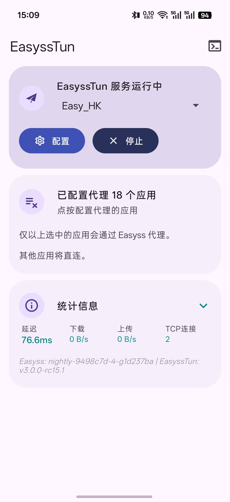
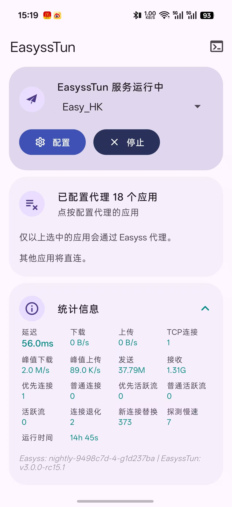
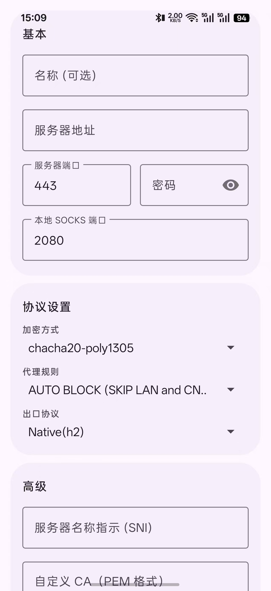
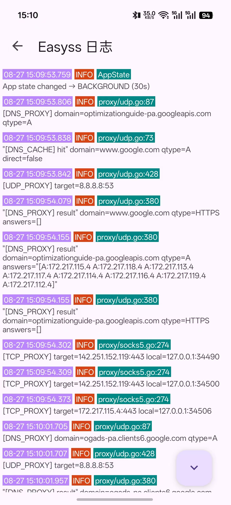

# EasyssTun

> **Note:** 此仓库 fork 自 [bingooo/EasyssTun](https://github.com/bingooo/EasyssTun)。

基于 [easyss](https://github.com/nange/easyss) 代理的轻量级 Android VPN，底层使用高性能、低开销的 [tun2socks](https://github.com/heiher/hev-socks5-tunnel) 实现。

## APP截图

<div align="center">
  
  &nbsp;&nbsp;
  
  &nbsp;&nbsp;
  
</div>
<div align="center">
  
  &nbsp;&nbsp;
  
  &nbsp;&nbsp;
  
</div>

## 构建方式

```bash
git clone --recursive https://github.com/nange/EasyssTun.git
cd EasyssTun
make build
```

也可直接在Release页面下载编译好的APK文件。

## 更新子模块 

```bash
git submodule update --init --recursive

cd path/to/submodule
git fetch origin 
git checkout <commit version> | <main>
git submodule update | git pull --recurse-submodules

---------------
git add path/to/submodule
git commit -m "更新子模块至 <version>"

git push origin <path>
```
