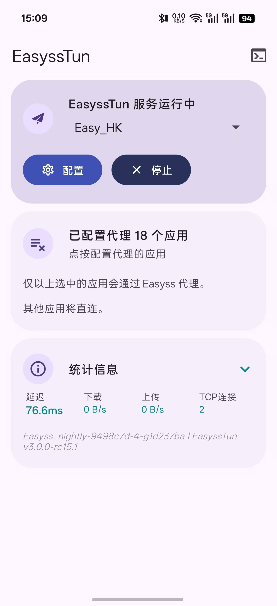
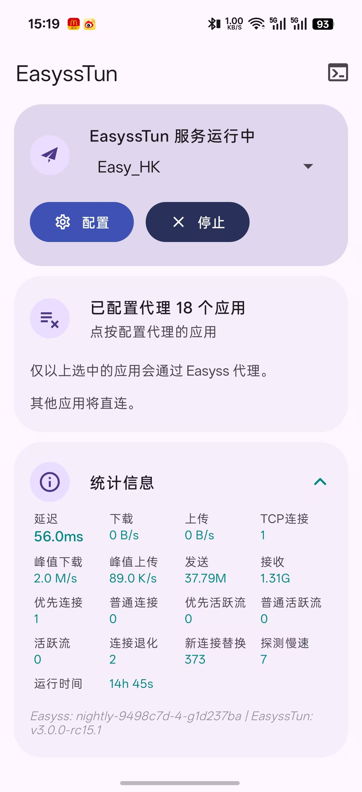
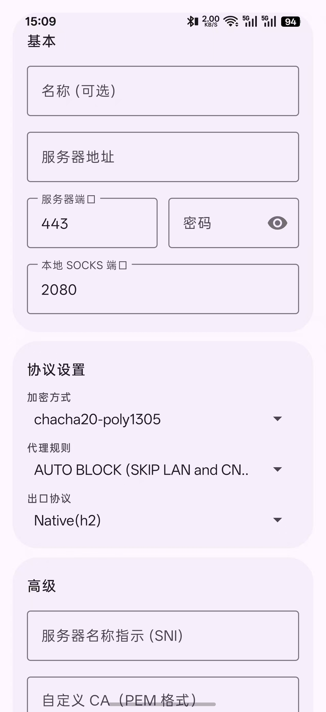
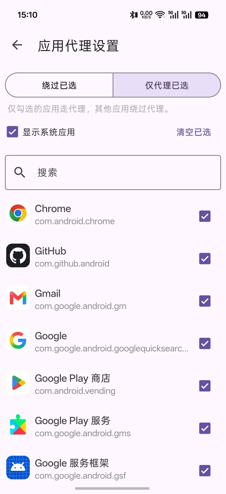
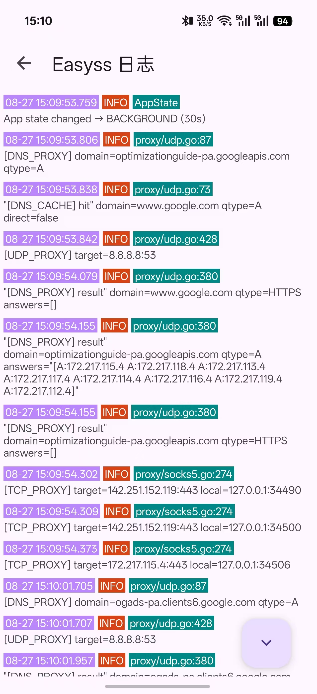

# EasyssTun

> **Note:** 此仓库 fork 自 [bingooo/EasyssTun](https://github.com/bingooo/EasyssTun)。

基于 [easyss](https://github.com/nange/easyss) 代理的轻量级 Android VPN，底层使用高性能、低开销的 [tun2socks](https://github.com/heiher/hev-socks5-tunnel) 实现。

## APP截图

<div align="center">
  
  &nbsp;&nbsp;
  
  &nbsp;&nbsp;
  
</div>
<div align="center">
  
  &nbsp;&nbsp;
  
  &nbsp;&nbsp;
  
</div>

## 构建方式

```bash
git clone https://github.com/nange/EasyssTun.git
cd EasyssTun
make build
```

首次构建时会自动从 GitHub Release 下载 `libeasyss.aar` 与 `hev-socks5-tunnel.aar` 到 `app/libs/`，无需 NDK。

Windows 下同样可以直接 `make build`（Makefile 会按平台自动选择 wrapper：Windows 上统一经 `cmd /c gradlew.bat` 调用，兼容 cmd.exe、PowerShell 与 Git Bash/MSYS）；若未安装 GNU Make，在 PowerShell/cmd 中执行 `.\gradlew.bat assembleDebug` 即可。

也可直接在Release页面下载编译好的APK文件。

## 升级 tun2socks

hev-socks5-tunnel（tun2socks）以预编译 AAR 形式引入，版本由 `version.properties` 中的 `hevSocks5TunnelVersion` 锁定。升级步骤：

1. 到上游 [heiher/hev-socks5-tunnel](https://github.com/heiher/hev-socks5-tunnel) 的 Releases 页面确认新版本已包含 `hev-socks5-tunnel.aar` 资产（上游自 `2.18.0` 起官方构建 AAR，无需 fork）。
2. 更新本仓库 `version.properties` 中的 `hevSocks5TunnelVersion` 为上游 tag（如 `2.18.0`）。
3. 删除本地 `app/libs/hev-socks5-tunnel.aar`，下次构建自动重新下载。
4. 上游 AAR 必须带 `classes.jar`（绑定类 `hev.htproxy.TProxyService`），否则 Kotlin 编译期即失败；JNI 契约由 `TProxyJniContractTest` 守护。
